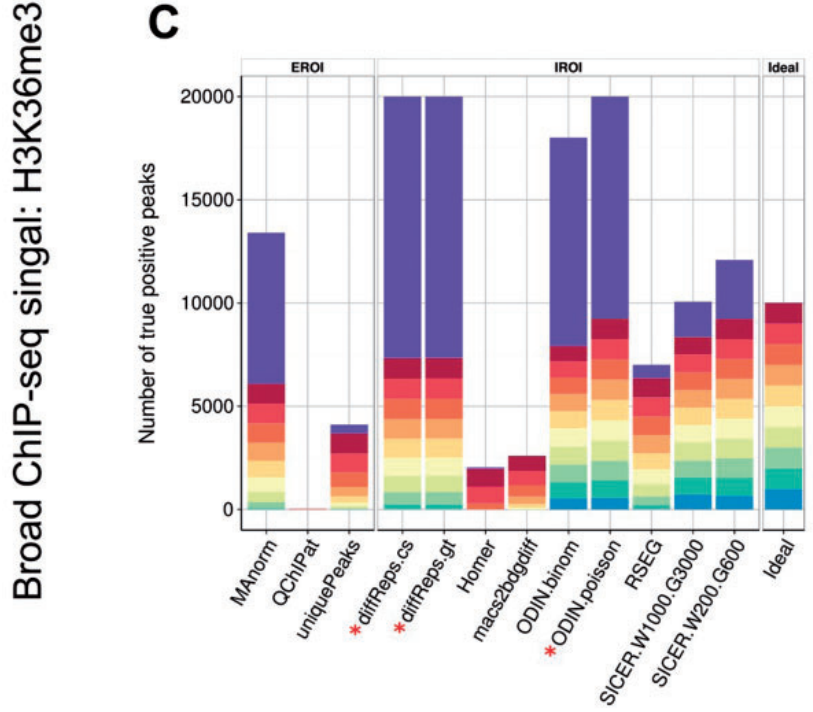

# epic: diffuse domain ChIP-Seq caller based on SICER

[](https://travis-ci.org/biocore-ntnu/epic) [](https://coveralls.io/github/biocore-ntnu/epic?branch=master) [](https://landscape.io/github/biocore-ntnu/epic/master) [](http://bioconda.github.io/recipes/epic/README.html) [](http://bioepic.readthedocs.org/en/latest/)

epic is a software package for finding medium to diffusely enriched domains in
chip-seq data. It is a fast, parallel and memory-efficient implementation of the
incredibly popular SICER algorithm. By running epic on a set of data ("ChIP")
files and control ("Input") files, epic is able to quickly
differentially enriched regions.

epic is an improvement over the original SICER by being faster, more memory
efficient, multicore, and significantly much easier to install and use.

The MIT-licensed code is available at https://github.com/endrebak/epic

The [documentation](http://bioepic.readthedocs.io/en/latest/) is currently being worked on.

<!-- If you use, or intend to use epic, please say hi in this google -->
<!-- groups -->
<!-- [thread](https://groups.google.com/forum/#!topic/epic-chip-seq/zWlsun_yfZQ). -->
<!-- This would help me better understand how many people actually use it - it seems -->
<!-- like the bugreports, stars and feature requests I get is only a teensy tip of the ice -->
<!-- berg. -->

<!-- markdown-toc start - Don't edit this section. Run M-x markdown-toc-generate-toc again -->
**Table of Contents**
- [epic: diffuse domain ChIP-Seq caller based on SICER](#epic-diffuse-domain-chip-seq-caller-based-on-sicer)
    - [Install](#install)
    - [Changelog](#changelog)
    - [Improvements](#improvements)
    - [Version](#version)
    - [License](#license)
    - [Requirements](#requirements)
    - [Helper scripts](#helper-scripts)
    - [Usage](#usage)
    - [Credit](#credit)
    - [NAQ/Various](#naqvarious)


<!-- markdown-toc end -->
## Citation

For now, please cite the original SICER paper, but include a link to this repo.

## Install

epic is available for python2.7 and above. It can be installed from the Python
Package Index with `pip install bioepic` or preferably from bioconda with `conda
install -c bioconda epic`, or by cloning the repo at
https://github.com/endrebak/epic and running `python setup.py install`
<!-- , with bioconda using `conda install bioepic` ([bioconda setup instructions](http://bioconda.github.io/index.html#setup)) -->

## Changelog

```
# 0.2.8 (16.01.18)
- various updates to epic-cluster
- epic-cluster now can create bigwig
- add C. Elegans genomes (ce10, ce11)
- add pseudocounts to ChIP to avoid -inf in bigwigs

# 0.2.7 (12.12.17)
- Add bed with region statistics to epic-cluster output
- Fix bug due to new concat of empty dfs behavior in Pandas
- Fix bug that split enriched regions that should have been whole.
- Fix for new NA behavior
- Fix epic-merge with regions

# 0.2.6 (13.11.17)
- fix issue #66 (thanks nw11)
```

## Quickstart

```
$ pip install bioepic
$ # you only need git clone to get the test data
$ git clone https://github.com/endrebak/epic.git
$ # -t is treatment files, -c input (control) files
$ epic -t epic/examples/test.bed -c epic/examples/control.bed > results.csv
```

## Improvements

#### Actively developed

Will be maintained and further updated.

We hope to make further refinements to the actual algorithm and make it even better.

#### Functionality

epic accepts several input and ChIP files at the same time and accepts bed files
- both block-zipped and gzipped.

Works on files of any size.

Works on all Python versions 2.7/3+.

#### Speed

epic can use one core per chromosome, which should give a speedup of < ~22-25
(differs by species) by itself. In addition, epic uses the Python science stack,
including Pandas, for almost all tasks, which means each core runs heavily
optimized C, Fortran and Cython code for further speed gains.

#### Memory

epic streams the data instead of loading it all into memory, which should result
in a much smaller memory footprint.

#### Usage

Instead of needing eleven command line arguments to run, epic contains sensible
defaults and only needs the files it is to analyze as parameters.

epic can be run from whichever location with files found anywhere on the disk.

Contains many [genomes](https://github.com/endrebak/epic/tree/master/epic/scripts/chromsizes), with updated effective genome sizes. If your genome isn't listed, please request it!

## Version

This is a beta release. Please do aggressively report issues, quirks, complaints and anything that just feels slightly off to the issue tracker. Also please ask questions and make docrequests - there are loads of neat stuff I have not documented.

## License

MIT

## Requirements

Python data science stack and a fairly recent version of Pandas (0.17 >=).
Python 2.7 or 3+.
Various unix tools found on all major distributions.

For the effective genome size script [jellyfish2](https://github.com/gmarcais/Jellyfish) is required.

## Helper scripts

See [this page](helper_scripts.md) for the various helper scripts that are a part of epic.

## Converting bam files to bed

If you have bam files, these can be converted to bed with the command

```
bamToBed -i file.bam > file.bed
```

If you have paired-end data, you can use

```
bamToBed -bedpe -i paired_end_file.bam > file.bedpe
```

## Usage

(Might be slightly out of date.)

```
usage: epic [-h] --treatment TREATMENT [TREATMENT ...] --control CONTROL
            [CONTROL ...] [--number-cores NUMBER_CORES] [--genome GENOME]
            [--keep-duplicates] [--window-size WINDOW_SIZE]
            [--gaps-allowed GAPS_ALLOWED] [--fragment-size FRAGMENT_SIZE]
            [--false-discovery-rate-cutoff FALSE_DISCOVERY_RATE_CUTOFF]
            [--effective_genome_fraction EFFECTIVE_GENOME_FRACTION]
            [--chromsizes CHROMSIZES] [--store-matrix STORE_MATRIX]
            [--bigwig BIGWIG] [--sum-bigwig SUM_BIGWIG] [--bed BED]
            [--log LOG] [--outfile OUTFILE] [--version]

Diffuse domain ChIP-Seq caller based on SICER. (Visit github.com/endrebak/epic
for examples and help.)

optional arguments:
  -h, --help            show this help message and exit
  --treatment TREATMENT [TREATMENT ...], -t TREATMENT [TREATMENT ...]
                        Treatment (pull-down) file(s) in (b/gzipped) bed/bedpe
                        format.
  --control CONTROL [CONTROL ...], -c CONTROL [CONTROL ...]
                        Control (input) file(s) in (b/gzipped) bed/bedpe
                        format.
  --number-cores NUMBER_CORES, -cpu NUMBER_CORES
                        Number of cpus to use. Can use at most one per
                        chromosome. Default: 1.
  --genome GENOME, -gn GENOME
                        Which genome to analyze. Default: hg19.
  --keep-duplicates, -k
                        Keep reads mapping to the same position on the same
                        strand within a library. Default is to remove all but
                        the first duplicate.
  --window-size WINDOW_SIZE, -w WINDOW_SIZE
                        Size of the windows to scan the genome. WINDOW_SIZE is
                        the smallest possible island. Default 200.
  --gaps-allowed GAPS_ALLOWED, -g GAPS_ALLOWED
                        Multiple of window size used to determine the gap
                        size. Must be an integer. Default: 3.
  --fragment-size FRAGMENT_SIZE, -fs FRAGMENT_SIZE
                        (Single end reads only) Size of the sequenced
                        fragment. The center of the the fragment will be taken
                        as half the fragment size. Default 150.
  --false-discovery-rate-cutoff FALSE_DISCOVERY_RATE_CUTOFF, -fdr FALSE_DISCOVERY_RATE_CUTOFF
                        Remove all islands with an FDR below cutoff. Default
                        0.05.
  --effective_genome_fraction EFFECTIVE_GENOME_FRACTION, -egf EFFECTIVE_GENOME_FRACTION
                        Use a different effective genome fraction than the one
                        included in epic. The default value depends on the
                        genome and readlength, but is a number between 0 and
                        1.
  --chromsizes CHROMSIZES, -cs CHROMSIZES
                        Set the chromosome lengths yourself in a file with two
                        columns: chromosome names and sizes. Useful to analyze
                        custom genomes, assemblies or simulated data. Only
                        chromosomes included in the file will be analyzed.
  --store-matrix STORE_MATRIX, -sm STORE_MATRIX
                        Store the matrix of counts per bin for ChIP and input
                        to gzipped file <STORE_MATRIX>.
  --bigwig BIGWIG, -bw BIGWIG
                        For each file, store a bigwig of both enriched and
                        non-enriched regions to folder <BIGWIG>. Requires
                        different basenames for each file.
  --sum-bigwig SUM_BIGWIG, -sbw SUM_BIGWIG
                        Store two bigwigs - one of ChIP, one of input - to
                        folder <SUM-BIGWIG>.
  --bed BED, -b BED     A summary bed file of all regions for display in the
                        UCSC genome browser or downstream analyses with e.g.
                        bedtools. The score field is log2(#ChIP/#Input) * 100
                        capped at a 1000.
  --log LOG, -l LOG     File to write log messages to.
  --outfile OUTFILE, -o OUTFILE
                        File to write results to. By default sent to stdout.
  --version, -v         show program's version number and exit
```

## Credit

Chongzhi Zang, Dustin E. Schones, Chen Zeng, Kairong Cui, Keji Zhao and Weiqun Peng for the original SICER. Please consider citing their paper (*in addition* to our eventual paper) if you use epic. And if you use any (helper) scripts in SICER that are not included in epic you should of course cite the SICER paper!

Most of the improvements in epic were possible due to Python Science libraries that were not available when SICER was originally written. Thanks to the Pandas developers!

#### Author

Endre Bakken Stovner

#### Contributors

* Pål Sætrom (algorithmic/theoretical discussions, endless patience)
* Dario Beraldi (argparsing)
* Ryan Dale (bioconda, ideas, genome info script)
* Ryan C. Thompson (bigwig improvements, mypy typing)

#### Thanks

* Piotr Balwierz (helping me debug the paired-end mode)
* Keith Siklenka (lending me a subset of some paired-end ChIP-Seq files)

#### Performance, differential ChIP-Seq



Briefings in Bioinformatics, 2016, 1–14

## NAQ/Various

Answers to some questions no-one has ever asked me.

#### Why is the SICER algorithm so great?

The wonderful thing about the SICER algorithm is that is very careful about dropping windows with few reads in them. All ChIP-seq callers I know have some preprocessing step where this is done liberally. SICER pools these windows together and gives them a composite score, allowing very long stretches of very diffuse signal to be detected.

#### Why another ChIP-Seq domain caller?

MACS2 is great for narrow peaks, but epic performs better on diffuse domains. For medium size domains, such as PolII, our tests indicate that both perform about equally well, but epic uses only a fraction of the time.

#### Why not SICER?

SICER contains a great algorithm and is a wonderful piece of software, but advances in the Python data science libraries has made it possible to implement it much more efficiently. Furthermore, SICER was not made to handle the mountains of data we have now; it simply cannot run on very large datasets due to (sensible) restrictions in the original implementation.

#### When is your paper coming out?

Dunno. We do not want to write a methods paper, but rather just include a section about epic in an appropriate biology paper sometime.

#### Why the name epic?

It stands for electronic pic [sic] caller or epigenome cartographer, whichever you prefer. Or perhaps it isn't just another bogus bioinformatics acronym. Hope you find the name fitting.

But suggestions for better names accepted. On paper I liked the epi/epic/epigenetics link but now when I hear it it sounds so boastful I cringe. exorcised sounds like a slight on the original software... Mad MACS?

#### Which other ChIP-Seq callers do you use?

* [SICER](http://home.gwu.edu/~wpeng/Software.htm) - great diffuse domain ChIP-Seq caller (which epic is based on.)
* [SICERpy](https://github.com/dariober/SICERpy) - a wrapper around SICER for convenience/parallelism. Stole some good ideas from there.
* [csaw](https://github.com/LTLA/csaw) - R package. Uses an approach to island finding that complements epic very well. Requires more statistical sophistication and programming skill to use.
* [MACS2](https://github.com/taoliu/MACS) - my preferred peak caller.
