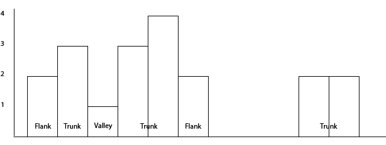

epic-cluster
============

When doing differential analysis of multiple ChIP-Seq experiments, one problem
is to choose the regions that should be tested for differential enrichment.
This is the problem epic-cluster tries to solve.

epic-cluster takes one merged-matrix created by the epic-merge tool and clusters
the genomic bins within it to produce regions that should be tested for
differential enrichment.

Several algorithms might be added to the tool; for now epic-cluster contains
one, which we have called trunks, flanks and valleys.

Algorithm: trunks, flanks and valleys
~~~~~~~~~~~~~~~~~~~~~~~~~~~~~~~~~~~~~

Each matrix from epic-merge contains a column with the number of experiments in
which the bin was considered part of an enriched region. In this example the
matrix contains four experiments. The illustration below shows which regions
were considered enriched in which experiments:

.. _trunks_flanks_valleys_counts:

   Which regions are enriched in which experiments.

In the illustration below you see how this translates into clusters:

.. _trunks_flanks_valleys:

   The trunks, flanks and valleys algorithm.

In :numref:`trunks_flanks_valleys` there are two clusters of bins. The
first cluster is subdivided into five regions, the second is not subdivided into
any.

This algorithm first looks for genomic bins that are at most
`--distance-allowed` apart. So if the bin-size is 200 and the
`--distance-allowed` is 400, the data is subdivided into two clusters as seen
above (since the two clusters are separated by 3 bins or 600 nucleotides).

In the first cluster the max number of enriched regions of any bin is 4 and the
`--trunk-diff` has the default value, namely 1. So anything with 4 -
`--trunk-diff` number of enriched regions is considered a trunk, while anything
else is a flank or a valley. Flanks and valleys are regions where the total
number of enriched is lower than `max_enriched - trunk-diff`. Flanks lie at the
edges of a cluster, while valleys lie in-between trunks.

Options
~~~~~~~

* **-m, --matrix**

   A single epic-merge output matrix.

* **-t, --trunk-diff**

   The difference in number of enriched regions that decides when to consider a
   subregion a flank or valley, instead of a trunk. If you do not want to split
   clusters into flanks and valleys, you can set this to a high number.

* **-d, --distance-allowed**

   The number of nucleotides before two bins are considered to be in separate
   clusters.

* **-b, --bin-size**

   The bin-size used in the input matrix file. Auto-inferred by default.

* **-cpu, --number-cores**

   The number of cores to use. Can at most use one per chromosome

Example
~~~~~~~

We start with an epic-merge matrix that only includes two experiments:

.. code-block:: bash

    zcat 0_12.gz | head
    # Chromosome Bin TotalEnriched Exp1_0h.bed Exp1_12h.bed Exp2_0h.bed Exp2_12h.bed Exp1_0h_Input.bed Exp1_12h_Input.bed Exp2_0h_Input.bed Exp2_12h_Input.bed
    # chr1 264400 1.0 1.0 1.0 5.0 3.0 0.0 0.0 0.0 0.0
    # chr1 264600 1.0 3.0 3.0 3.0 5.0 1.0 2.0 0.0 1.0
    # chr1 265200 1.0 3.0 6.0 2.0 2.0 4.0 3.0 2.0 0.0
    # chr1 265400 1.0 2.0 1.0 2.0 0.0 1.0 2.0 1.0 3.0
    # chr1 265800 1.0 7.0 12.0 6.0 7.0 0.0 2.0 4.0 3.0
    # chr1 268400 1.0 5.0 5.0 6.0 5.0 6.0 3.0 3.0 3.0
    # chr1 268600 1.0 2.0 0.0 0.0 0.0 0.0 0.0 0.0 0.0
    # chr1 269000 1.0 4.0 1.0 0.0 2.0 1.0 3.0 1.0 0.0
    # chr1 269200 1.0 0.0 1.0 3.0 2.0 0.0 0.0 2.0 1.0

Since it only includes two experiments, the TotalEnriched column can only
include 1 or 2 (which means the bin was enriched in 1 or 2 experiments) [#]_.

Since the TotalEnriched-column is either 1 or 2, we set the `-trunk-diff` option
to 0, which means that for a region where the max TotalEnriched is 2, a count of
2 will be considered a trunk, while 1 will be a flank or a valley. For a region
where the max TotalEnriched is 1, everything is a trunk.

.. code-block:: bash

    epic-cluster -cpu 25 -t 0 -m 0_12.gz -o 0_12_cluster.gz
    zcat 0_12_cluster.gz

These are what the results look like:

.. code-block:: bash

    zcat 0_12_cluster.gz | head
    Index Exp1_0h.bed Exp1_12h.bed Exp2_0h.bed Exp2_12h.bed Exp1_0h_Input.bed Exp1_12h_Input.bed Exp2_0h_Input.bed Exp2_12h_Input.bed
    # chr1_0_264400:264799_trunk 4.0 4.0 8.0 8.0 1.0 2.0 0.0 1.0
    # chr1_1_265200:265599_trunk 5.0 7.0 4.0 2.0 5.0 5.0 3.0 3.0
    # chr1_2_265800:265999_trunk 7.0 12.0 6.0 7.0 0.0 2.0 4.0 3.0
    # chr1_3_268400:268799_trunk 7.0 5.0 6.0 5.0 6.0 3.0 3.0 3.0
    # chr1_4_269000:269599_trunk 8.0 6.0 6.0 5.0 2.0 7.0 4.0 1.0
    # chr1_5_862200:865199_trunk 19.0 27.0 20.0 35.0 11.0 12.0 10.0 8.0
    # chr1_6_882000:884599_flank 25.0 22.0 16.0 27.0 17.0 15.0 8.0 13.0
    # chr1_6_884600:887399_trunk 23.0 35.0 30.0 43.0 19.0 12.0 15.0 15.0
    # chr1_6_887400:887599_flank 1.0 2.0 2.0 4.0 0.0 2.0 1.0 1.0

Since most tools for differential analysis are written in R, which only accepts
one index column, all the data about the region is squashed into the first
column.

.. [#] If epic-merge was used with the option `--keep-nonenriched`, the
       TotalEnriched column can also include 0.
