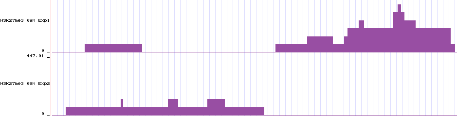

Output files
============

epic can produce many output files. Here we explain what they contain.

-o/--outfile
~~~~~~~~~~~~

The main output is the file of regions with an FDR score lower than the cutoff (0.05 by default).

.. code-block:: text

    # epic -cpu 25 -t examples/test.bed -c examples/control.bed -o enriched_regions.csv
    Chromosome Start End ChIP Input Score Log2FC P FDR
    chr1 23568400 23568599 2 0 13.54464274405703 11.30748585550573 8.184731894908448e-11 6.319374393278151e-10
    chr1 26401200 26401399 2 0 13.54464274405703 11.30748585550573 8.184731894908448e-11 6.319374393278151e-10
    chr1 33054800 33055399 2 0 14.288252844518933 9.722523354784574 2.207263610333191e-09 3.85690272963484e-09
    chr1 33365200 33365399 2 0 13.54464274405703 11.30748585550573 8.184731894908448e-11 6.319374393278151e-10
    chr1 39422200 39422799 2 0 14.288252844518933 9.722523354784574 2.207263610333191e-09 3.85690272963484e-09
    chr1 51473600 51474399 2 0 14.288252844518933 9.30748585550573 5.228937118152232e-09 6.861688234097e-09
    chr1 58785200 58786199 2 0 14.288252844518933 8.985557760618368 1.0206726421638307e-08 1.1002055753194539e-08
    chr1 59430000 59430199 2 0 13.54464274405703 11.30748585550573 8.184731894908448e-11 6.319374393278151e-10

The first two lines are special and do not contain any data:

* The first line contains the command invoked
* The second line contains the column names

The column names are:

* **Chromosome, Start, End**

This is the location of the region.

* **ChIP, Input**

These two columns contain the number of ChIP-reads and Input-reads within the
region.

* **Score**

(Mostly uninteresting to end users). This is the region Poisson score.

* **Fold_change**

The log2_fold change is the number of ChIP reads divided by the number of Input
reads in the region (where a pseudocount is computed for regions with no
input-reads.)

* **P**

This is the p-value, based on the Poisson-distribution.

* **FDR**

FDR is the p-value adjusted for multiple testing with Benjamini-Hochberg.

-b/--bed (optional)
~~~~~~~~~~~~~~~~~~~

This is a bed file of the regions. This file is intended for downstream analyses
with tools like bedtools or for display in the UCSC genome browser. (As opposed
to the `--output` file which contains more statistical info and the read counts
for a region and is not usable as-is by most tools.)

The three first columns are the region, the fourth is the FDR score (same as in
the --outfile), and the fifth contains the log2 fold change * 100 capped at 1000.
The sixth contains the strand, but ChIP-Seq data is not stranded.

-sm/--store-matrix
~~~~~~~~~~~~~~~~~~

This option gives a matrix of counts for each genomic bin (tile/window) for all
the bed/bedpes given to epic. It is intended for downstream statistical
analyses. It is gzipped since it can be enormously big.

* **Chromosome**, **Bin**

    The two first columns give the location of the bin (window).

* **Enriched**

    This column tells whether the bin was part of an enriched region
    (according to the FDR cutoff given to epic). 0 means no and 1 means yes.

* **chip1.bed**, **input1.bed**, ..., **chipn.bed**, **inputn.bed**

    The next columns are the files used in the epic analysis and contain the
    read-count for each bin. In the example below the files used are
    examples/test.bed and examples/control.bed so this is what the columns are
    called too.

.. code-block:: bash

    epic -t examples/test.bed -c examples/control.bed -sm matrix.gz > /dev/null
    zcat matrix.gz  | head # gzcat on some mac OSes
    # Chromosome Bin Enriched examples/test.bed examples/control.bed
    # chr1 887600 0 0 1
    # chr1 994600 0 0 1
    # chr1 1041000 0 0 1
    # chr1 1325200 0 1 0
    # chr1 1541600 0 1 0
    # chr1 1599000 0 1 0
    # chr1 1770200 0 0 1
    # chr1 1820200 0 1 0
    # chr1 1995000 0 0 1

-bw/--bigwig (optional)
~~~~~~~~~~~~~~~~~~~~~~~

This flag takes a folder to store bigwigs in. One bigwig file is created per
bed/bedpe file given for epic to analyze. The scores are RPKM-normalized.

.. code-block:: bash

    epic -bw bigwigs/ -t examples/test.bed -c examples/control.bed \
                -o examples/expected_results_log2fc.csv
    ls bigwigs/
    # control.bw test.bw

These bigwigs show how epic saw the data. So the data will look like a histogram
where the bars are bins and the counts within a bin gives the height of the bar.
The results are RPKM-normalized. Here are two bigwigs displayed in an arbitrary
genomic region in the UCSC genome browser:

-i2bw/--individual-log2fc-bigwigs
~~~~~~~~~~~~~~~~~~~~~~~~~~~~~~~~~

This flag takes a folder to store bigwigs in. One bigwig file is created per
bed/bedpe file given for epic to analyze. The scores are RPKM-normalized and
divided by the mean of the summed input RPKM. A pseudocount of one is given to
bins with no input. I is the number of Input-files in the equation below:

.. math::

   log_2 \frac{RPKM_{ChIP}}{\frac{{\sum_{i=1}^{I} RPKM_{Input_i}}}{I}}

.. code-block:: text

    chr1	23568400	23568599	6.319374393278151e-10	1000.0	.
    chr1	26401200	26401399	6.319374393278151e-10	1000.0	.
    chr1	33054800	33055399	3.85690272963484e-09	1000.0	.
    chr1	33365200	33365399	6.319374393278151e-10	1000.0	.
    chr1	39422200	39422799	3.85690272963484e-09	1000.0	.
    chr1	51473600	51474399	6.861688234097e-09	1000.0	.
    chr1	58785200	58786199	1.1002055753194539e-08	1000.0	.
    chr1	59430000	59430199	6.319374393278151e-10	1000.0	.
    chr1	65065600	65066199	3.85690272963484e-09	1000.0	.
    chr1	91625400	91625799	1.8569048582126885e-09	1000.0	.

-cbw/--chip-bigwig
~~~~~~~~~~~~~~~~~~

The ChIP-bigwig creates a common bigwig for all the ChIP-Seq files. First the
RPKM is computed for each bed/bedpe file, then these are added together and
the `--chip-bigwig` is produced.

The value in each bin is (where C is the number of ChIP-files):

.. math::

   \frac{\sum_{i=1}^{C} RPKM_{ChIP_i}}{C}

-ibw/--input-bigwig
~~~~~~~~~~~~~~~~~~~

The Input-bigwig creates a common bigwig for all the input files. First the
RPKM is computed for each bed/bedpe file, then these are added together and
the --input-bigwig is produced.

The value in each bin is (where I is the number of Input-files):

.. math::

   \frac{\sum_{i=1}^{I} RPKM_{Input_i}}{I}

-2bw/--log2fc-bigwig
~~~~~~~~~~~~~~~~~~~~

Sums of the RPKM-scores for each library is computed like described in `-cbw`
and `-ibw`. Then a pseudocount of one is added to each bin with a count of zero
in the input. Finally the summed ChIP and Input vectors are divided and then the
log2 is computed.

.. math::

   log_{2} \frac{\frac{\sum_{i=1}^{C} RPKM_{ChIP_i}}{C}}{\frac{\sum_{i=1}^{I} RPKM_{Input_i}}{I}}

-l/--log
~~~~~~~~

Write all the logging messages to a file (in addition to stderr).
